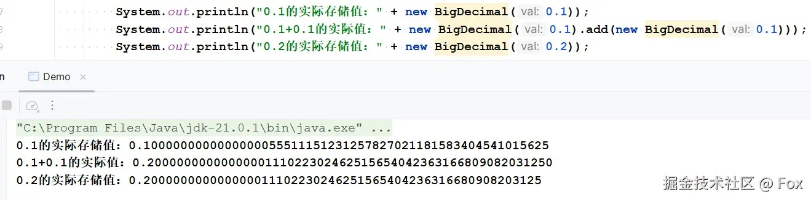

---
nav:
  title: 面试
  order: -1
group:
  title: js
  order: 3
---

# 知识点

## Object.is() 与原来的比较操作符 “===”、“==” 的区别?
1. 两等号判等,会在比较时进行类型转换;
2. 三等号判等(判断严格),比较时不进行隐式类型转换,(类型不同则会返回false);
3. Object.is 在三等号判等的基础上特别处理了 NaN 、-0 和 +0 ,保证 -0 和 +0 不再相同,但 Object.is(NaN, NaN) 会返回 true。
Object.is 应被认为有其特殊的用途,而不能用它认为它比其它的相等对比更宽松或严格。

## 谈谈你对闭包的理解？
* 形成：函数嵌套函数，并且内部函数调用父级函数作用域的变量就可以称之为闭包；
* 作用：
  * 好处：可以使代码更加灵活和可重用，可以将一些逻辑封装在函数内部，形成一个“私有”的作用域，避免变量/函数等命名冲突；
  * 坏处：如果不恰当的使用闭包，会导致内存泄漏，当函数执行完毕，其内部变量任然被使用着，因此需要注意及时释放内存；过度使用也会存在代码阅读性的降低等情况；
  * 举例：
  ```
  var module = (function() {
    var privateVar = "I am private.";
    
    function privateFunc() {
      console.log("This is a private function.");
    }
    
    return {
      publicVar: "I am public.",
      
      publicFunc: function() {
        console.log("This is a public function.");
      }
    };
  })();

  console.log(module.publicVar); // 输出 "I am public."
  module.publicFunc(); // 输出 "This is a public function."
  console.log(module.privateVar); // undefined
  module.privateFunc(); // 抛出 TypeError 异常

  // 说明：
  在上述代码中，module 变量被赋值为一个立即执行函数的返回值，这个函数返回一个包含公有变量和方法的对象。私有变量和函数都定义在立即执行函数内部，并且不可外部访问，从而实现了模块化。
  ```

## 都知道0.1+0.2≠0.3，为啥 0.1+0.1 却等于 0.2？
A: 在计算过程中，会把十进制的数转换成二进制,像0.1、0.2、0.3这类小数，二进制是无限循环的，而尾数位只有 52 位，必须舍入，所以存储的是 “近似值”，不是数学上的精确值。加法结果是否相等，本质是 “两个近似值相加后，是否等于目标值的近似存储值”。
如下：
```c
// Java中打印0.1的实际存储值（不是数学上的0.1）
System.out.println(new BigDecimal(0.1)); 
// 输出：0.1000000000000000055511151231257827021181583404541015625

// 打印0.1+0.1的实际值
System.out.println(new BigDecimal(0.1).add(new BigDecimal(0.1))); 
// 输出：0.200000000000000011102230246251565404236316680908203125

// 打印0.2的实际存储值
System.out.println(new BigDecimal(0.2)); 
// 输出：0.200000000000000011102230246251565404236316680908203125
```
 
> 工程中怎么避免这个问题？
>> * Java 用 BigDecimal（注意用 String 构造，别用 double 构造）；js也有类似的金额计算库;
>> * 或者把小数转成整数计算（比如金额乘 100 转成分，计算完再转回来）。

