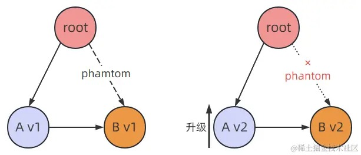
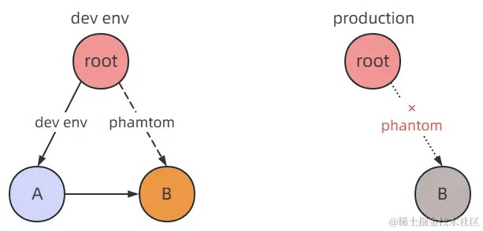

---
nav:
  title: 面试
  order: -1
group:
  title: node
  order: 2
---

# 知识点

## express+node使用doctor部署后，如果挂了怎么办？
A: 针对部署的应用挂了，需要明确知道是什么原因挂了，以及挂了之后怎么快速解决；后面怎么避免出现此问题。

1. 需要在这个应用内部有明确的日志信息，一些异常日志收集能力实现；同时如果在docker上部署，可以借助docker的日志脚本排查具体原因；
2. 确保应用程序健康，在代码中捕获所有可能异常，避免主进程异常退出；使用try/catch方式、或者使用process.on('uncaughtException', callback)来捕获未处理的异常等；
3. 使用进程管理器的方式：pm2来管理进程，实现应用程序的崩溃重启；
4. 定期检查资源限制：明确知道某些场景下的高峰使用状态定时观察，超过一定水位，调整容器的资源限制等；
5. 针对日志、异常、水位等需要有明确的日志和告警机制建设；提前感知应用异常状况；

## 幽灵依赖什么？pnpm是怎么解决幽灵依赖的？
A：幽灵依赖：指的是在项目中使用了一些没有定义在package.json中的包；
> ### 幽灵依赖现象：
>>1.会引起「版本」问题；
  
  举例： 如上图；比如说我们这里有一个项目，安装了A这个库，版本是 v1，但是 A 库又依赖一个B库，版本也是 v1。我们项目里明明没有手动安装这个 B 库，但是在项目里边仍然可以去导入它并且使用，这就产生了幽灵依赖。一旦有一天因为某种原因，我们要把 A 库进行升级，升级的 v2 的版本，v2 这个版本有可能要使用 B 库的 v2 版本，于是 B 库也会跟着升级，而 B 库升级之后，它里边有些 API 可能有变动，那么就会导致我们之前用 B 库的代码出问题了。
>>2.会引起「依赖丢失」问题：
  
  举例：如上图；现在的问题和版本无关了，项目使用开发依赖安装了一个 A 库，A 库又依赖 B 库，然后项目里导入了 B 库来使用。因为我们 A 库使用的是开发依赖，而到了生产环境我们就不会安装这个 A 库了，那么 A 依赖的 B 也不会被安装，但是我们在开发的时候又去使用了这个 B，到了生产环境 B 库也没了，这就导致了依赖丢失。这个问题同样很难排查，在本地好好的到了生产环境就出问题了。
>
> ### yarn为什么也会出现幽灵依赖
>>yarn只是采用扁平化的策略来解决依赖嵌套问题，但是没有解决幽灵依赖问题；还是会存在没有在 package.json 文件中声明的依赖项，但在项目代码里却可以 require 进来 这个也很容易理解，因为依赖的依赖被扁平化安装在顶层 node_modules 中，所以我们能访问到依赖的依赖。
>
> ### pnpm的解决方式
>>pnpm 的理念是把所有的包，存到一个仓库文件夹里，然后再node_modules里使用正常的树形结构来表达我们的包依赖，那你说这样子不是有重复项了吗？其实并没有，因为这里它使用的是链接的方式也就是说树形结构并不占空间，而只是指向仓库里的一个个链接。
  
  举例：将原来的 node_modules 删除后，我们使用 pnpm 安装，你就会发现现在 node_modules 变成如上图；对于依赖的内部依赖统一放入 .pnpm 文件夹下；这样在项目代码中无法通过 require 方式去引用依赖的依赖了。
>
>同时通过 node_modules 中的依赖使用硬链接方式指向磁盘空间，而依赖包的内部依赖通过软连接方式指向.pnpm文件夹方式，减少磁盘使用空间；
