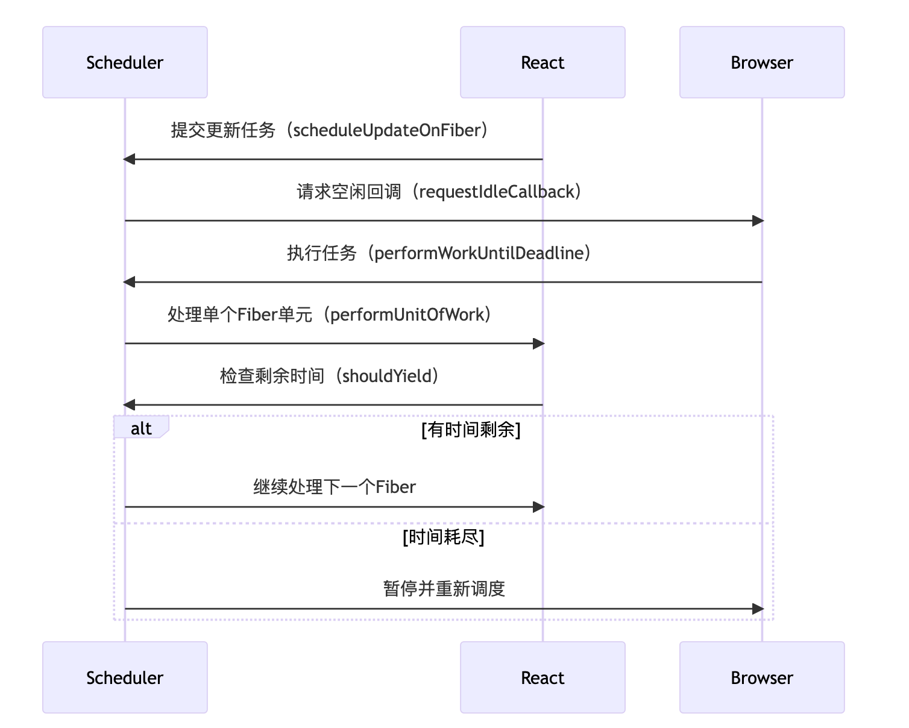

---
nav:
  title: 面试
  order: -1
group:
  title: react
  order: -1
---

# 知识点

## react中使用到了fiber,什么是fiber?
A: 在react中fiber是一个协调算法，是一个虚拟的堆栈，fiber节点对象，代表了React元素的工作单元；使用它的目的是为了解决大型应用树更新时的问题，并且支持更灵活的更新调度（如优先级调度、中断、恢复等）,Fiber是从react16开始被引入；
```
为什么需要Fiber？
在Fiber之前，React使用递归的方式遍历组件树，一旦开始更新就会一直占用主线程直到更新完成，这可能会导致掉帧（特别是当组件树很大时）。Fiber将更新过程拆分成多个小任务，并且允许中断和恢复，这样调度器就可以根据优先级来安排工作，提高用户体验。

Fiber的主要特性
可中断与恢复：将渲染工作拆分成多个小任务，可以在多个帧中执行，并且可以中断高优先级的更新，待完成后再恢复低优先级的更新。

优先级调度：可以为不同的更新分配优先级，例如用户交互的更新优先级高于网络请求返回数据的更新。

并发模式：Fiber是React并发模式（Concurrent Mode）的基础，允许React同时准备多个版本的UI。

Fiber节点的结构
每个Fiber节点都是一个JavaScript对象;

Fiber的工作流程
Fiber的渲染分为两个阶段：

协调/渲染阶段：这个阶段是可中断的，React会遍历组件树，为每个组件生成Fiber节点，构建Fiber树，并标记需要更新的节点（副作用）。这个阶段不会更新DOM。

提交阶段：这个阶段是同步的，不可中断。React会处理所有标记的副作用，更新DOM，并执行生命周期函数和Hooks（如useLayoutEffect）等。

```

## react可执行中断渲染从底层怎么做到的?
1. 关键机制：时间切片

* React 将渲染任务拆分为多个 Fiber 工作单元，通过浏览器 API（如requestIdleCallback 或 MessageChannel）在空闲时段执行；



2. 双缓存技术
* React 维护两棵 Fiber 树：
>>> Current Tree：当前渲染的树（对应屏幕上显示的内容）。\
>>> WorkInProgress Tree：正在构建的新树（可中断修改）。

中断时：保存当前处理的 Fiber 节点指针（workInProgress） 恢复时：从上次中断的 Fiber 节点继续处理;
```
function workLoopConcurrent() {
  while (workInProgress !== null && !shouldYield()) {
    performUnitOfWork(workInProgress);
  }
  // 如果被中断，workInProgress会保留当前节点
}
```

## react中使用hooks为什么不能在if中处理？
这是react hooks的规则之一：不要在循环、条件或者嵌套函数中调用hook；\
原因：
1. react依赖于hook的调用顺序来正确的将状态与对应的hook关联起来；如果在条件中调用一个hook，那么当条件变化时，hook的调用顺序就会改变，导致状态混乱,原先的状态在相应的位置没有找到，或者在相应的位置拿的不对。

```
// React 内部简化的状态管理机制
let hooks = [];        // 存储所有 Hook 状态
let currentHook = 0;   // 当前 Hook 的索引

function useState(initialValue) {
  const position = currentHook++;
  
  if (hooks[position] === undefined) {
    // 对数据进行相应位置存储
    hooks[position] = initialValue;
  }
  
  const setState = (newValue) => {
    // 执行时，对新对象赋值到相应位置
    hooks[position] = newValue;
    render(); // 触发重新渲染
  };
  
  return [hooks[position], setState];
}

function useEffect(callback, deps) {
  const position = currentHook++;
  // ... 类似的实现
}

// 组件渲染前重置索引
function renderComponent(Component) {
  currentHook = 0; // 每次渲染都从 0 开始
  return Component();
}
```
问题演示：
``` // ❌ 错误示例：条件调用 Hook
function ProblematicComponent({ shouldShow }) {
  const [name, setName] = useState('John');
  
  if (shouldShow) {
    // 这个 Hook 有时调用，有时不调用
    const [age, setAge] = useState(25);
  }
  
  const [email, setEmail] = useState('john@example.com');
  
  return (
    <div>
      <p>Name: {name}</p>
      {shouldShow && <p>Age: {age}</p>}
      <p>Email: {email}</p>
    </div>
  );
}

// 错误示例渲染演示
// 第一次渲染：shouldShow = true
// Hook 调用顺序：
// 0: useState('John')     -> name
// 1: useState(25)         -> age  
// 2: useState('john@example.com') -> email

// 第二次渲染：shouldShow = false
// Hook 调用顺序：
// 0: useState('John')     -> name
// ❌ 1: useState('john@example.com') -> 错误！这个现在对应了 age 的位置
// ❌ 2: ??? -> 缺少第三个 Hook！
```

## 为什么React的hook需要使用链表形式存储？
在React中，Hooks在组件中每次渲染时都会被调用，而且它们的调用顺序必须稳定。React需要存储这些Hook的状态，并且在多次渲染之间能够保持状态，同时还要能够根据调用顺序来定位到每一个Hook。

顺序性：Hooks的调用顺序在每次渲染时必须一致，链表是一种线性结构，能够很好地保持元素的顺序。

动态操作：链表可以方便地在任意位置插入或删除节点，虽然Hooks在运行时不会频繁插入删除，但是Hooks的数量可能会变化（比如条件判断中Hook的调用不同），但React不允许这样做，因为会破坏顺序。然而，在组件挂载时，Hooks的初始化顺序是固定的，链表可以按顺序记录。

内存效率：链表在添加节点时不需要连续的内存空间，可以动态分配，这对于Hooks的状态存储是合适的。

遍历操作：在组件渲染时，Hooks需要按照顺序被遍历执行，链表的顺序遍历非常高效。

## fiber render阶段 commit 阶段, 哪一个阶段是可以被打断的， commit的阶段能被打断吗?
A: render阶段可以被打断，commit阶段不能；\
原因：
1. Render阶段被称为“协调”过程，react会遍历组件树，通过diff算法比较新旧VDom，确定哪些更新需要被应用到真实的dom上；render阶段的工作是在内存中进行的，它不直接操作真实的dom，即使中断了用户也看不到任何中间状态；react使用的是fiber架构，会把整个render阶段分解成一个个小的“工作单元”，然后再去检查主线程是否还有空闲时间；如果此时有更高优先级的任务，react可以暂停当前的render，先去处理高优先级的任务，等主线程空闲了再去处理之前的工作；避免长时间占用主线程导致页面卡顿，从而提升用户体验；
2. commit阶段是将render阶段计算的变更一次性的应用到真实dom上；对真实dom进行增删改等；commit阶段是同步执行，一旦开始就必须一气呵成，直到完成所有dom更新；

## 为什么react中不建议key为index索引？
A：会存在性能问题和渲染错误的现象，例如对列表进行排序、插入或删除时，使用索引作为key会导致状态混乱等情况，因为索引没有变，但其实对应的数据已经发生了变化，react会认为任然是同一个组件，从而可能错误的复用组件实例；
